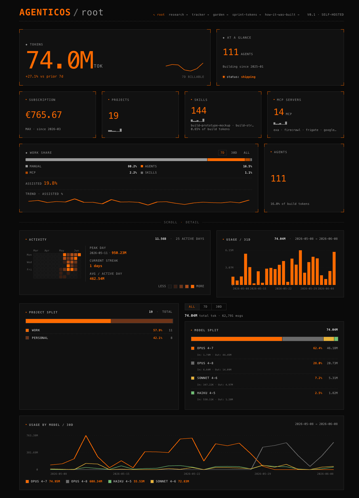

# AgenticOS

Self-hosted CV + ops dashboard, built end-to-end by AI sub-agents — one kanban card at a time. Live at **[agenticos.sethsendom.com](https://agenticos.sethsendom.com)**.

The point isn't the dashboard. It's the proof that an AI-assisted product build can be **measured and verified — to the token** — instead of just claimed.

As of the latest snapshot: **74M tokens** metered · **111 agents** · **144 skills** · **14 MCP servers** · **19 projects** · **~€765 lifetime** on Claude (Max since 2026-03) · **148 of 171 stories** shipped across **71 one-hour sprints**. Every number is parsed from real `~/.claude/` run logs — nothing is typed in by hand.

## The problem it solves

Claude Max bills through a `modelUsage` meter, and the meter misleads. An agent's self-reported tokens count only what's billed — real compute is dominated by `cache_read` volume, which runs 4–6× higher. The weekly quota shows a percentage dial with no token ceiling, so you can't tell when the window closes until it already has.

So this dashboard tracks spend across all four API dimensions — `input`, `output`, `cache_creation`, `cache_read` — and reads it through three accounting lenses: `modelUsage` velocity, real `$` cost, and quota-delta (remaining-capacity estimate). No single number tells the whole story; the three together do.

## Site map

| Route | Access | What's there |
|---|---|---|
| `/` | public | CV dashboard — tokens, projects, skills, agents, MCPs, cumulative spend, model split, activity heatmap |
| `/how-it-was-built` | public | The build receipt — problem/solution, milestone kanban, every epic and story, sourced from the [agentic-os-pmo](https://github.com/SethMK/agentic-os-pmo) sister project |
| `/research/explorer` | public | Every research hypothesis, faceted by theme / state / weight-of-evidence, on an evidence × recency scatter |
| `/research/tracker` | public | A CI-style board: what's **validated**, what's **watching** (and how close to promotion), what's **queued** |
| `/research/garden` | public | The learnings as an RPG skill-tree — validating a hypothesis unlocks its dependents |
| `/research/sprint-tokens` | public | Per-sprint token decomposition for all 71 sprints, with honest ±50% noise badges and a cap-model explainer |
| `/ops` | private | Cloudflare Access (Google SSO). Real project names, weekly-limit window, monthly spend, per-project cost |

## How it's built

A single orchestrator runs the work one story at a time. It pulls one kanban card, dispatches an **implementer** sub-agent to write the code, then a **qa-verifier** sub-agent to check the acceptance bullets against a cold rebuild + Playwright. No parallel work-in-progress unless two cards provably touch disjoint files.

Each story carries an `owner` role — `orchestrator`, `data-pipeline`, `frontend`, `backend`, `infra-deploy`, `designer` — that tags what kind of work it is. Sprint ceremonies add three planning voices: a **Scrum Master** (capacity + token monitoring), a **Product Owner** (acceptance + priority), and a **Chief Scientist** (the baseline-first research method). Planning and methodology live in the sister repo.

Story state machine: **Backlog → Ready → In Progress → Review → Done**.

## Stack

| Layer | Tech |
|---|---|
| Frontend | Astro (SSR) |
| Runtime | Bun |
| Auth | Cloudflare Tunnel + Cloudflare Access (Google SSO) |
| Data pipeline | Mac-side walker scans `~/.claude/projects/` → 15-min snapshots → rsync to a Proxmox LXC |
| Storage | JSON snapshots (history-accumulating) |

## Calibration over story points

Stories are sized by the **shape of their verification protocol**, not lines of code. A one-line CSS fix that still needs a cold rebuild + Playwright pass costs the same ~130k-token floor as a small feature with the same protocol. Every bucket below is re-derived from logged token + time runs:

| Bucket | Typical scope |
|---|---|
| S-inline | Single-file edit, no QA pair |
| S-with-QA | One-file fix + implementer / QA pair |
| M-data | Pipeline step + attribution-coverage QA |
| M-frontend | One component or surgical page edit + Playwright |
| L-single | Hairy single component + Playwright |
| Spike | Time-boxed research, no commit expected |

Observed floor: **~130k tokens** for any cold-rebuild + Playwright story, regardless of edit size. Verification shape dominates code surface.

## Code

The implementation lives in a private repo. This public README documents the architecture, the live URL, and the methodology. Companion repo: **[agentic-os-pmo](https://github.com/SethMK/agentic-os-pmo)** — the planning workspace that drives the build.

---

Built by [Marcin Kokott](https://linkedin.com/in/marcinkokott) — Head of Product & Delivery, Vazco.
