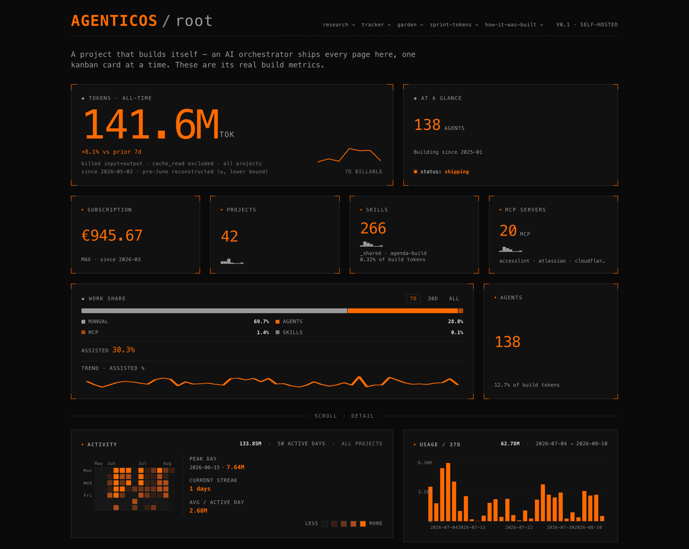
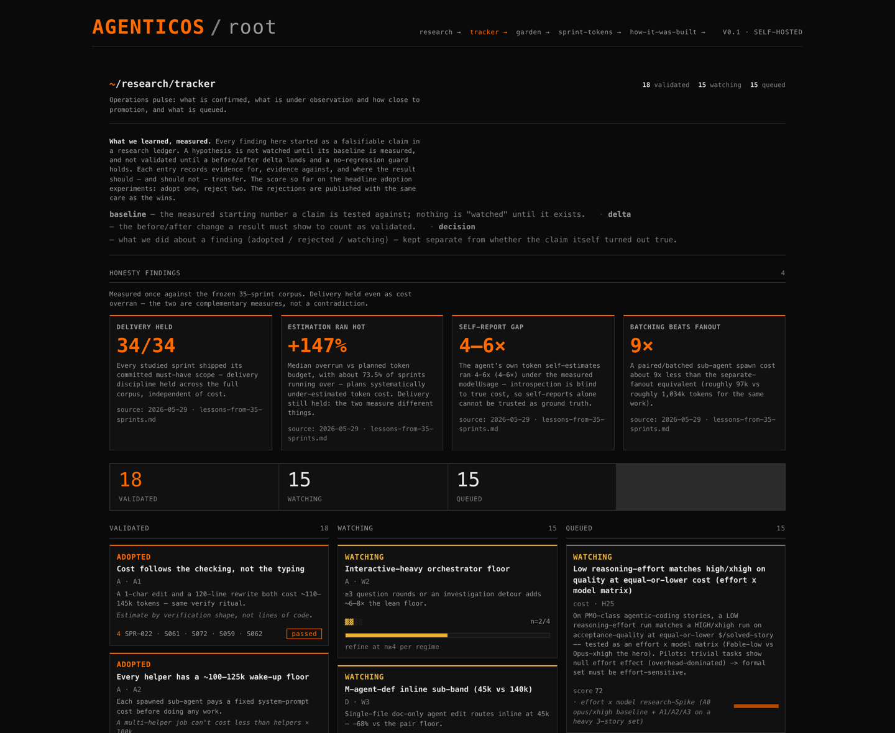

# AgenticOS

A self-hosted dashboard that measures the AI work that built it. Every page of
[agenticos.sethsendom.com](https://agenticos.sethsendom.com) was written by AI coding agents
pulling one kanban card at a time, directed by a product manager who writes no code by hand. The
numbers on the site are that same work: tokens, projects, the agents and skills in operation, and
a running subscription total, all parsed from real `~/.claude/` run logs rather than typed in.

**100M+ metered tokens · 150+ one-hour sprints · 270+ stories.** Counts as of August 2026; the
site itself is the current version.

## The problem it solves

Claude Max bills through a `modelUsage` meter, and the meter misleads. An agent's self-reported
tokens count only what is billed, while real compute is dominated by `cache_read` volume running
4–6× higher. The weekly quota shows a percentage dial with no token ceiling, so you cannot tell
when the window closes until it already has.

So the dashboard tracks spend across all four API dimensions (`input`, `output`,
`cache_creation`, `cache_read`) and reads it through three lenses: `modelUsage` velocity, real
cost in euros, and a quota-delta estimate of remaining capacity. No single number tells the whole
story; the three together do.

## Site map

| Route | Access | What is there |
|---|---|---|
| `/` | public | The dashboard: tokens, projects, skills, agents, MCP servers, cumulative spend, model split, activity heatmap |
| `/how-it-was-built` | public | The build receipt: problem and solution, milestone kanban, every epic and story, sourced from the [agentic-os-pmo](https://github.com/SethMK/agentic-os-pmo) sister repo |
| `/research/explorer` | public | Every hypothesis, faceted by theme, state and weight of evidence, on an evidence-by-recency scatter |
| `/research/tracker` | public | A board of what was adopted, what is under observation, what is queued, and what got rejected |
| `/research/garden` | public | The findings as a skill tree, where validating one unlocks its dependents |
| `/research/sprint-tokens` | public | Per-sprint token decomposition, with noise badges and a cap-model explainer |
| `/ops` | private | Behind Cloudflare Access. Real project names, weekly-limit window, monthly spend, per-project cost |

## How it is built

One orchestrator runs the work a story at a time. It pulls a kanban card, sends an implementer
sub-agent to write the code, then a separate verifier sub-agent to check the acceptance bullets
against a cold rebuild and a browser test run. Nothing runs in parallel unless two cards
provably touch different files. Sprint planning adds three voices: a scrum master watching
capacity and tokens, a product owner watching acceptance and priority, and a chief scientist
holding the measure-the-baseline-first rule.

Stories move Backlog to Ready to In Progress to Review to Done. Planning and method live in the
sister repo.

## Stack

Astro with server-side rendering on Bun, served from a Proxmox LXC through a Cloudflare Tunnel,
with Cloudflare Access (Google SSO) gating `/ops`. A Mac-side pipeline scans `~/.claude/projects/`
every fifteen minutes, writes snapshots, and rsyncs them across. Unit tests cover the pipeline
and API; Playwright covers the pages.

## Code

The implementation sits in a private repo. This public one carries the write-up, the live URL and
the screens. Sister repo: [agentic-os-pmo](https://github.com/SethMK/agentic-os-pmo), the planning
workspace that drove the build.

Built by [Marcin Kokott](https://linkedin.com/in/marcinkokott).
